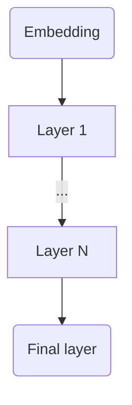
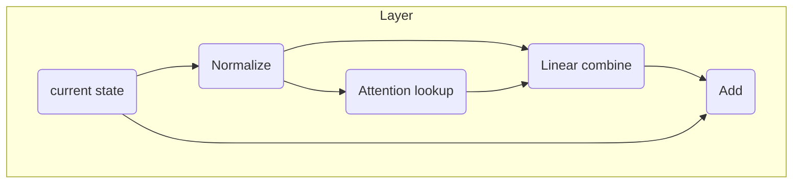

# 3Lin Transformer Model

This transformer model is a product of ablation study which parts of the original transformer architecture are essential for achieving good performance on language modelling task. Title of the original paper claims "Attention is all you need". Indeed, looks like attention can not be removed without loss of model quality. However non-linear feed-forward network can be replaced with linear composition of single attention head result vector with the current state vector.

Let's look into this simplified transformer model. It consists of embedding, set of layers and final linear layer.



Each layer consists of state normalization, attention lookup, linear combine of attention result with the state vector.



Let's omit dimenstion reductions for clarity. First we normalize current state vectors:

$$x_k = Normalize(state_k)$$

Then we perform regular softmax attention to previous state vectors $x_k$ excluding current state vector $x_t$. Attention weight is computed with bilinear form $Q$:

$$att_t = \frac{\sum_{k=0..t-1} e^{x_k^T Q  x_t} x_k}{\sum_{k=0..t-1} e^{x_k^T Q  x_t}}$$

Then we update each component of the current state vector $state_t[i]$ with bilinear form $Combiner_i$. You can think of this operation as multiplication of 3D Combiner tensor by current state vector and attention result vector resulting in a 1D delta state vector. Combiner tensor represent trilinear operation hence the name Triple Linear Transformer or 3Lin for short.

$$state_t[i] += att_t^T \cdot Combiner_i \cdot x_t$$

In einsum terms we perform this operation:

```python
state += torch.einsum('tx,ty,xyz->tz', att, x, Combiner)
```

## Dimension reduction

Size of bilinear form $Q$ grows with state vector dimension $dim$ as $dim^2$. To save compute and model size without significant loss of model accuracy we use low rank approximation of matrix Q with two matrices of $dim \times qdim$ dimension.

$$Q=QK^T \cdot QV$$

Dimension of $Combiner$ grows even faster as $dim^3$. To save memory and compute we use dimension reduction and sparsification. First $att_t$ and $x_t$ vectors are multiplied by dimension $dim \times ttdim$ K and V matrices

$$att\\_ lowrank_t = V \cdot att_t$$

$$x\\_ lowrank_t = K \cdot x_t$$

This way we reduce required $Combiner_i$ dimension to $ttdim \times ttdim$. To reduce number of parameters further we use only subset of $Combiner_i$ elements. We select 16 elements of each bilinear form row. For row $i$ we will consider elements with indices $i,k$ where $k=i \space xor b$ and $b=0..15$

$$\sum_i \sum_k x_i \cdot y_k \cdot bilinear\\_ form_{i,k} \rightarrow \sum_i \sum_{b=0..15} x_i \cdot y_{i \oplus b} \cdot bilinear\\_ form_{i, i \oplus b}$$

This way 3D $Combiner$ tensor approximation requires only $16 \times ttdim \times dim$ parameters. Selecting 16 elements per row seems to strike good balance between model quality degradation and computation savings.

## Vectors normalization

To achieve training stability we want to avoid components growing quadratically as training progresses. We get quadratic growth at attention weight compute  $x^T\cdot QK^T\cdot QV \cdot x$ since we tune both $QK$ and $QT$. In trilinear $Combiner$ operation we get even cubic growth since we tune $Combiner$, $K$ and $V$ matrices. To get linear growth we normalize $att\\_lowrank$, $x\\_lowrank$ and $QK \cdot x$ vectors.

## Attention, position encoding

For position encoding code uses variation of Alibi. Unlike original alibi, code uses linear and hyperbolic distance penalties:

$$
AttentionDecay(distance) = -Slope * distance + Hyper / distance
$$

To save compute not all layers use full window width to compute attention. By default layers use context window of 64 and only 'wide' layers use full window.  

It is possible to tune attention decay parameters with GD. However good enough results can be obtained with fixed  set of attention decay parameters. By default per layer Alibi parameters alternate between these settings:

| Layer |Slope  |Hyper  |Wide |
|-------|-------|-------|-----|
|0      |0      | 6.6   |     |
|1      |0      | 0     | yes |
|2      |0      | 13.3  |     |
|3      |0.25   | 0     |     |
|4      |0      | 20    |     |
|5      |0.5    | 0     |     |

## Initialization

Dimension reduction model matrices are initialized with normally distributed random variables. Combiner tensor is initialized with zeros.

## Quantization

Code uses int8 for model tensors. Normalized state vector is also cast to int8 to use faster int8 matmul operations. During training float precision model is kept in host memory. Upon model matrices update quantized model matrices are copied to GPU. This approach leads to reduced GPU memory consumption at the expense of significant pcie traffic.

To experiemnt with stronger then int8 model parameters quantization see MPF_SIM_QUANT_2BIT. This flag rounds intf8 to 4 values before copying to GPU effectively simulating 2 bit model parameters precision.

Gradients are computed with half float precision, dynamic range of gradient components is very large and without special effort numbers do not fit into int8. Gradients are normalized before each layer backprop compute to maintain numeric stability.

## Loss minimization method

To optimize 3Lin Transformer model Adam optimizer can be replaced with regular stochastic gradient descent with gradient normalization.

For each model tensor loss gradient is computed. Then each tensor gradient is normalized to have L2 (Frobenius) norm 1, scaled with learning rate and added to model.

For token embeddings layer and final linear layer gradients for parameters of different tokens are significantly different and vary from batch to batch. To account for this final layer and embeddings are considered not matrices but sets of vectors, one vector for each token. Gradient is normalized separately for each vector. For these gradients exponential averaging over gradient history is used to improve training stability with smaller batch sizes.

